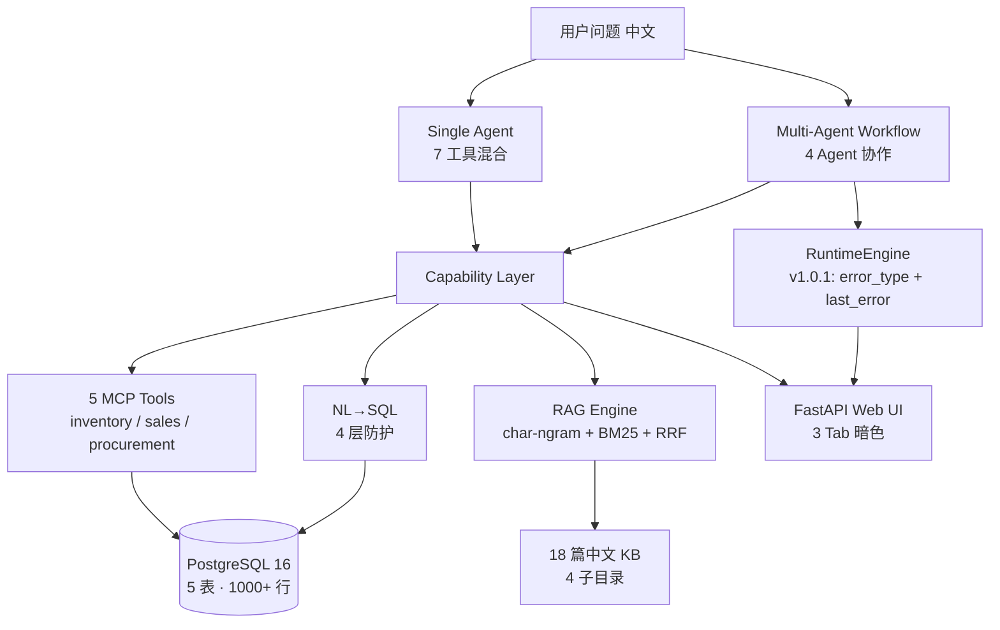

# 🚀 ERP AI Copilot v1.0.1 — Bug Fixes + Improved Stability

> Released on **2026-06-12** · Tag: `v1.0.1-erp-copilot` · [Full release notes →](https://github.com/blank5this/MACS/blob/main/RELEASE_NOTES_v1.0.1.md)

v1.0.1 is a **drop-in bug fix patch** for [v1.0.0](https://github.com/blank5this/MACS/releases/tag/v1.0.0-erp-copilot): 2 real code issues fixed (LLM Agent hardcoded prompt + RuntimeEngine swallowing exceptions), **16 new tests** pushing total to **168 passed**. **100% backward compatible** — upgrade with `git pull` and you're done.

---

## 🐛 Bug Fixes

- 🔧 **LLM Agent 硬编码 SYSTEM_PROMPT** — `LLMPlannerAgent` / `LLMExecutorAgent` / `LLMReviewerAgent` 在 v1.0.0 通过 `super().__init__(system_prompt=self.SYSTEM_PROMPT)` 写死了类变量, 完全忽略 caller 传入的 `system_prompt` 参数. 这导致 `macs_pkg/erp/agents/templates.py` 里的 `ERP_PLANNER` 模板无法注入渲染好的 prompt. v1.0.1 改成显式 `system_prompt: Optional[str] = None` 参数, caller 优先, 类变量兜底.

- 🔧 **RuntimeEngine 吞 provider 异常** — v1.0.0 当 `stop_on_error=False` 时, 引擎返回 `{"error": "..."}` 但**丢失原始 exception 类型**. `TimeoutError` vs `ConnectionRefusedError` 没法区分, workflow 没法做智能重试. v1.0.1 多带 `error_type` 字段 + engine 多 `last_error: Optional[BaseException]` 属性, caller 可以 `isinstance(engine.last_error, TimeoutError)` 做路由.

---

## ✨ What's New

- ✅ **16 new tests** in `tests/test_v101_fixes.py` (9 LLM agent override + 7 error propagation)
- ✅ **168 tests passing** (was 152 in v1.0.0, **+10.5%**)
- ✅ **`error_type` field** on engine result dict — smart routing for retry/switch-provider
- ✅ **`last_error` / `last_error_task_id`** on `RuntimeEngine` instance — direct exception introspection
- ✅ **100% backward compatible** — no API changes, only additive fields/properties

---

## 📊 By the Numbers

| Metric | v1.0.0 | v1.0.1 | Delta |
|--------|--------|--------|-------|
| Tests (non-integration) | 152 | **168** | **+16** (+10.5%) |
| LLM Providers | 6 | 6 | — |
| MCP Tools | 5 | 5 | — |
| Agent Templates | 4 ERP + 1 KB | 4 ERP + 1 KB | — |
| KB Docs | 18 (135 chunks) | 18 (135 chunks) | — |
| Web Endpoints | 4 | 4 | — |
| CI Jobs | 8 (4 main + 4 ERP) | 8 (4 main + 4 ERP) | — |
| Bug Fixes | 4 | **6** (4 + 2) | **+2** |
| Patch Size | — | **~18 KB** | new |

---

## 🚀 Quickstart

```bash
# Clone + checkout
git clone https://github.com/blank5this/MACS.git && cd MACS
git checkout v1.0.1-erp-copilot

# Install + run (60 seconds to Web UI)
pip install -r requirements.txt
make erp-run
# → http://localhost:8001 (3 Tab: Chat · Multi-agent Report · KB Search)
```

**Run multi-agent workflow in 3 lines**:

```python
from macs_pkg.erp.workflows import InventoryRiskWorkflow

wf = InventoryRiskWorkflow(provider=claude, pool=pool)
result = await wf.run("分析未来 30 天库存风险并给出采购建议")
print(result["final_report"])
```

---

## 🎬 Demo Videos

> 3 段 60s 视频脚本已就绪, 录完后替换此处的链接.

| # | 主题 | 旁白稿 |
|---|------|--------|
| 1 | **单 Agent 混合工具** — 7 工具自动选择 | [📝 script](https://github.com/blank5this/MACS/blob/main/docs/videos/01_single_agent_script.md) · _视频待录_ |
| 2 | **多 Agent 协作** — 4 Agent 接力, 4 段产物 | [📝 script](https://github.com/blank5this/MACS/blob/main/docs/videos/02_multi_agent_script.md) · _视频待录_ |
| 3 | **RAG 知识库** — 18 篇中文文档混合检索 | [📝 script](https://github.com/blank5this/MACS/blob/main/docs/videos/03_rag_script.md) · _视频待录_ |

---

## 🏗️ Architecture



---

## 🧪 Test Coverage

| 类别 | 文件 | 测试数 |
|------|------|--------|
| 数据层 | `tests/test_erp_db.py` | Day 1-3 |
| MCP 工具 | `tests/test_erp_mcp.py` | Day 4 |
| NL→SQL | `tests/test_nl2sql.py` + `test_nl2sql_safety.py` | Day 5-6 (4 层防护) |
| RAG | `tests/test_erp_rag.py` | Day 7 |
| 单 Agent | `tests/test_erp_copilot_agent.py` | Day 8 (14 个) |
| 模板 | `tests/test_erp_templates.py` | Day 9 (30 个) |
| 工作流 | `tests/test_inventory_workflow.py` | Day 10 (16 个) |
| 端到端 | `tests/test_e2e_workflow.py` | Day 11 (6 个 smoke) |
| Web | `tests/test_erp_web.py` | Day 12 (20 个 TestClient) |
| 健康 | `tests/test_erp_health.py` | Day 13 (17 个) |
| **v1.0.1 fixes** | **`tests/test_v101_fixes.py`** | **v1.0.1 (16 个 — 9 LLM + 7 error)** |
| **总计** | **12 个测试文件** | **168 passed** (+23 integration, 需 docker) |

---

## 📚 Documentation

- 📋 [CHANGELOG.md](https://github.com/blank5this/MACS/blob/main/CHANGELOG.md) — 完整变更日志
- 📑 [RELEASE_NOTES_v1.0.1.md](https://github.com/blank5this/MACS/blob/main/RELEASE_NOTES_v1.0.1.md) — 本次详细 release notes
- 📑 [RELEASE_NOTES_v1.0.0.md](https://github.com/blank5this/MACS/blob/main/RELEASE_NOTES_v1.0.0.md) — v1.0.0 回顾
- 📖 [README.md](https://github.com/blank5this/MACS) — 项目首页
- 🗺️ [MACS_ROADMAP.md](https://github.com/blank5this/MACS/blob/main/MACS_ROADMAP.md) — 路线图
- 📋 [ROADMAP_AUDIT_v1.0.1.md](https://github.com/blank5this/MACS/blob/main/ROADMAP_AUDIT_v1.0.1.md) — 完工度盘点
- 📖 [docs/use_cases/erp_ai_copilot.md](https://github.com/blank5this/MACS/blob/main/docs/use_cases/erp_ai_copilot.md) — ERP Copilot 综合索引
- 🏗️ [docs/architecture/erp_copilot.md](https://github.com/blank5this/MACS/blob/main/docs/architecture/erp_copilot.md) — 6 张架构图
- 🤝 [CONTRIBUTING.md](https://github.com/blank5this/MACS/blob/main/CONTRIBUTING.md) — 贡献指南
- 🔒 [SECURITY.md](https://github.com/blank5this/MACS/blob/main/SECURITY.md) — 安全策略

---

## 🙏 Acknowledgments

- **MACS 框架** — 通用多 Agent 框架经受住了 ERP 业务的考验
- **MCP 协议** — 工具层和 Agent 层解耦, 未来可暴露给 IDE / 其他 Agent 平台
- **RAGEngine + char-ngram + BM25 + RRF** — 中文场景的天作之合
- **6 个 LLM Provider** — 主力 Claude, 兜底 MiniMax, 测试用 mock
- **PostgreSQL + psycopg 3 async** — async 上下文里最稳的关系型数据库

---

## ⭐ Star us on GitHub!

如果觉得有用, 给我们一个 ⭐ — 这是开源项目最大的动力!

**👉 https://github.com/blank5this/MACS**

---

<sub>v1.0.1-erp-copilot · 2026-06-12 · [View all releases](https://github.com/blank5this/MACS/releases) · [Report an issue](https://github.com/blank5this/MACS/issues)</sub>