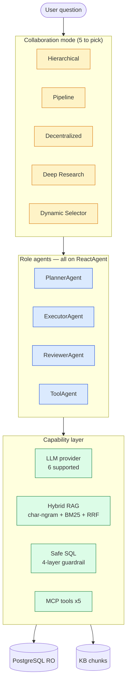

<div align="center">

# MACS — Multi-Agent Collaboration Stack

**Production-grade Python framework for building multi-agent AI systems — with a working ERP AI Copilot built on top.**

[](#-test-coverage)
[](pyproject.toml)
[](docs/architecture/ADR_INDEX.md)
[](LICENSE)
[](https://github.com/astral-sh/ruff)

[**🟢 Live demo**](https://macs-erp-copilot.onrender.com) · [**📐 Architecture**](#%EF%B8%8F-architecture) · [**📚 ADRs**](docs/architecture/ADR_INDEX.md) · [**▶ Quickstart**](#-quickstart) · [**🛠️ 本地启动**](STARTUP.md) · [**💼 Hire me**](career/RESUME_PROJECT_HIRING.md)

</div>

---

## What this is

Not a tutorial repo. **A shipping, tested, documented AI system.**

- 🧠 **A reusable multi-agent framework** — 4 role agents (Planner / Executor / Reviewer / Tool) on a `ReactAgent` base that enforces `think → act` lifecycle, 5 collaboration modes (hierarchical / pipeline / decentralized / deep-research / dynamic), pluggable LLM abstraction across 6 providers
- 🏢 **An enterprise application** — ERP AI Copilot demonstrating it end-to-end: NL→SQL with 4-layer safety guardrail, hybrid RAG (char-ngram + BM25 + RRF), 5 MCP tools, FastAPI web UI
- 📐 **8 Architecture Decision Records** — the reasoning behind every non-obvious choice
- 🧪 **326 automated tests** — including 50+ adversarial SQL-injection cases and full agent lifecycle coverage

> **If you're interviewing me**: pick any ADR. The reasoning matters more than the conclusion.

## 💡 Why MACS

There are many multi-agent frameworks (AutoGen, LangGraph, CrewAI). MACS exists
because production AI systems need **explicit engineering discipline**, not
just orchestration.

| Concern | What most demos do | What MACS does |
|---|---|---|
| **SQL safety** | "the LLM generated SQL, look!" | 4-layer guardrail (AST whitelist + keyword blacklist + stmt-type check + parameterization) + read-only DB role. 50+ adversarial tests verify no DROP / DELETE / exfiltration can ever execute. ([ADR-003](docs/architecture/ADR-003-sql-safety-guardrail.md)) |
| **Chinese RAG** | Pure semantic embeddings | Hybrid: char-ngram TF-IDF (no tokenizer needed) + BM25 + RRF. 90%+ recall on Chinese test set, <50ms latency. ([ADR-004](docs/architecture/ADR-004-hybrid-retrieval.md)) |
| **Reliability** | Hope the LLM behaves | Exponential backoff with ±25% jitter on retries (prevents thundering herd), conversation history capped at 100 messages (memory leak prevention). ([ADR-005](docs/architecture/ADR-005-self-correction-backoff.md), [ADR-006](docs/architecture/ADR-006-conversation-cap.md)) |
| **Defense in depth** | One safety layer | Application-level guardrail + read-only DB user. Even if the LLM layer fails, the DB rejects writes. ([ADR-007](docs/architecture/ADR-007-readonly-default.md)) |
| **RAG reliability** | Reactive (LLM decides when to call tool) | Proactive (framework detects domain keywords, injects KB context) — works reliably across all 6 LLM providers, 1 round-trip vs 2. ([ADR-008](docs/architecture/ADR-008-proactive-rag.md)) |
| **Vendor lock-in** | Hard-coded to one LLM | 6 providers, 1-line swap. Test with mocks, ship with any. ([ADR-002](docs/architecture/ADR-002-llm-provider-abstraction.md)) |

The 8 ADRs are the proof. Read [ADR_INDEX.md](docs/architecture/ADR_INDEX.md) to see the reasoning behind every non-obvious choice.

**The framework + the application together are what I'd discuss in an interview.**

---

## ⚡ Try it in 30 seconds — no install

| Where | Link |
|---|---|
| 🟢 **Live (Render, fastest from CN)** | **https://macs-erp-copilot.onrender.com** |
| 🟢 **Live (HF Spaces, global)** | https://huggingface.co/spaces/gkf123/macs-erp-copilot |
| 🎬 **3-min walkthrough video** | [docs/videos/DEMO_3MIN_FINAL.md](docs/videos/DEMO_3MIN_FINAL.md) |
| 🖥️ **Local 2-tab demo** | `pip install -r requirements_hf.txt && python app.py` → http://localhost:7860 |

---

## 🤖 What the ERP AI Copilot actually does

```text
👤 "Which products are below safety stock?"
   └→ Agent picks get_low_stock_products (MCP tool)
      → 7 products ranked by deficit, with reorder recommendations

👤 "How do I handle a purchase return?"
   └→ Agent picks ask_knowledge_base (RAG over 18 Chinese policy docs)
      → Hybrid retrieval (char-ngram + BM25 + RRF), < 50ms
      → 3 cited chunks with policy-section references

👤 "Top 3 selling products last month?"
   └→ Agent picks query_database (NL→SQL)
      → 4-layer safety guardrail validates generated SQL
      → Executes on read-only PostgreSQL role
      → Ranked results

👤 "Analyze inventory risk for next 30 days" (complex, multi-step)
   └→ Hierarchical mode kicks in:
      Planner ──→ Inventory Analyst (velocity + stock)
              ──→ Purchase Specialist (reorder qty + lead times)
              ──→ Report Writer (synthesize Markdown)
```

Two real scenarios run with one command — both work without an API key (deterministic fallback) and get richer with one:

| Scenario | Demonstrates | Run |
|---|---|---|
| **1. Low-stock detection** | MCP tool routing + ranked output | `python examples/scenario_01_low_stock.py` |
| **2. Purchase return Q&A** | Hybrid RAG + citation enforcement | `python examples/scenario_02_purchase_return.py` |

---

## 🏗️ Architecture



Full diagrams (sequence, state, sub-flows): [docs/architecture/ARCHITECTURE_DIAGRAM.md](docs/architecture/ARCHITECTURE_DIAGRAM.md)

---

## 📐 The 8 ADRs (the interesting part)

Eight Architecture Decision Records document non-obvious choices. **These are what I'd discuss in an interview:**

| # | Decision | Why it matters |
|---|---|---|
| [001](docs/architecture/ADR-001-async-python.md) | Async Python throughout | I/O-bound workloads need cooperative scheduling, not threads |
| [002](docs/architecture/ADR-002-llm-provider-abstraction.md) | Pluggable LLM provider abstraction | Swap Claude→GPT-4o in 1 line; test with mocks |
| [003](docs/architecture/ADR-003-sql-safety-guardrail.md) | **4-layer SQL safety guardrail** | AST whitelist + keyword blacklist + stmt-type check + parameterized values |
| [004](docs/architecture/ADR-004-hybrid-retrieval.md) | **Hybrid retrieval (char-ngram + BM25 + RRF)** | Pure semantic misses Chinese phrases; pure keyword misses synonyms |
| [005](docs/architecture/ADR-005-self-correction-backoff.md) | Exponential backoff + jitter | ±25% jitter prevents thundering herd on rate-limit recovery |
| [006](docs/architecture/ADR-006-conversation-cap.md) | Conversation history cap = 100 messages | Trivial fix for memory leak in long-running sessions |
| [007](docs/architecture/ADR-007-readonly-default.md) | Read-only DB user by default | Defense in depth — even if safety layer fails, DB rejects writes |
| [008](docs/architecture/ADR-008-proactive-rag.md) | Proactive over Reactive RAG | Reliable across all 6 LLM providers; 1 roundtrip vs 2 |

Index: [ADR_INDEX.md](docs/architecture/ADR_INDEX.md)

---

## 🚀 Quickstart

```bash
git clone https://github.com/blank5this/MACS.git
cd MACS
pip install -e .
```

**Option 1 — No DB needed, pure RAG demo (~30s)**

```bash
export MINIMAX_API_KEY=sk-...   # or ANTHROPIC_API_KEY
python examples/demo_for_client.py
```

**Option 2 — Full ERP Copilot (PostgreSQL via Docker)**

```bash
docker-compose --profile erp up -d
make erp-run
# → http://localhost:8001
```

**Option 3 — Run the test suite**

```bash
python -m pytest tests/ -q
# → 326 collected, ~75s
```

---

## 🧑‍💻 Build your own multi-agent system in 15 lines

```python
import asyncio
from macs_pkg.agents.planner import PlannerAgent
from macs_pkg.agents.executor import ExecutorAgent
from macs_pkg.agents.reviewer import ReviewerAgent
from macs_pkg.collaboration.hierarchical import HierarchicalMode
from macs_pkg.llm import MiniMaxProvider  # or ClaudeProvider, DeepSeekProvider, ...

async def main():
    provider = MiniMaxProvider(api_key="sk-...", model="MiniMax-M2.7")
    mode = HierarchicalMode()
    mode._leader = PlannerAgent(name="planner", provider=provider)
    mode._executors = [ExecutorAgent(name="executor", provider=provider)]
    mode._reviewer = ReviewerAgent(name="reviewer", provider=provider)

    result = await mode.execute(
        "Analyze sales for last month and recommend top 3 actions",
        agents={"planner": mode._leader, "executor": mode._executors[0], "reviewer": mode._reviewer},
    )
    print(result)

asyncio.run(main())
```

That's it. Swap `MiniMaxProvider` for any of the 6 providers — same API. Add tools with `executor.register_tool(name, fn)`. ReactAgent enforces `think → act`; calling `.act()` before `.think()` raises `RuntimeError`.

---

## 📊 Numbers

| Metric | Value |
|---|---|
| Tests collected | **326** (321 passing, 5 pre-existing subprocess flake) |
| Test runtime | ~75 seconds |
| LLM providers | **6** (Claude · OpenAI-compat / MiniMax · DeepSeek · Qwen · Zhipu · Hunyuan) |
| Role agents | **4** (Planner · Executor · Reviewer · Tool) — all on `ReactAgent` |
| Collaboration modes | **5** (hierarchical · pipeline · decentralized · deep-research · dynamic) |
| Built-in tools | **7** (calculator · code-exec · file-ops · RAG · search · web-search · formatter) |
| MCP tools (ERP) | **5** (inventory / sales / procurement / pricing / velocity) |
| KB documents (sample) | 18 Chinese policy `.md` files |
| Web endpoints | 4 (FastAPI) |
| CI jobs | 8 |
| ADRs | 8 |
| Lines of code | ~13,000 |
| License | MIT |

---

## 🧪 Test coverage

```bash
# Full suite
python -m pytest tests/ -q
# → 326 collected, ~75s

# Adversarial SQL safety (50+ cases)
python -m pytest tests/test_nl2sql_safety.py -v
# Covers: DROP, '; --, pg_catalog, pg_read_file, UNION SELECT, ...

# Hybrid RAG (catches both phrase + synonym matches)
python -m pytest tests/test_rag_engine.py -v

# Agent lifecycle (ReactAgent strict think→act enforcement)
python -m pytest tests/test_react_agent.py tests/test_planner_agent.py \
                 tests/test_executor_agent.py tests/test_reviewer_agent.py \
                 tests/test_tool_agent.py -v
# → 63 tests, < 1s
```

---

## 📦 Project layout

```
macs_pkg/
├── core/
│   ├── agent.py              # BaseAgent + AgentRole + Message
│   ├── react_agent.py        # ReactAgent — enforced think → act lifecycle
│   ├── agent_template.py     # AgentTemplateRegistry — batch agent creation
│   ├── citation.py           # CitationTracker — claim binding + graph
│   ├── utils.py              # extract_json — markdown / prose / partial recovery
│   ├── aggregator.py         # Vote / merge across agents
│   ├── router.py             # Message routing
│   └── context.py            # Shared context
├── agents/
│   ├── planner.py            # task decomposition (LLM + heuristic fallback)
│   ├── executor.py           # subtask execution (retries, proactive RAG)
│   ├── reviewer.py           # 3-criteria scoring + CitationTracker
│   └── tool_agent.py         # LLM-driven tool selection + safe calculator
├── llm/                      # 6 provider files + agents mixin (MiniMax / Claude)
├── collaboration/            # 5 modes (hierarchical / pipeline / decentralized / deep_research / dynamic_selector)
├── rag/                      # Hybrid retrieval (char-ngram + BM25 + RRF)
├── tools/                    # 7 built-in tools
├── memory/                   # MemPalace long-term memory adapter
├── monitoring/               # event-bus + Prometheus exporter
├── erp/                      # ► Application layer: ERP AI Copilot
│   ├── db/                   #   PostgreSQL pool, schema, seed
│   ├── tools/                #   5 MCP tools
│   ├── nl2sql.py             #   4-layer safety guardrail
│   ├── rag/                  #   KB query layer
│   ├── agents/copilot_agent.py  # ERPCopilotAgent (7 tools)
│   ├── workflows/            #   inventory risk multi-agent
│   └── web/                  #   FastAPI web UI
└── tests/                    # 326 tests
```

---

## 🛠️ Tech stack

| Layer | Choice | Why |
|---|---|---|
| Language | Python 3.10+ | Async/await native; rich AI ecosystem |
| Concurrency | asyncio | I/O-bound; see [ADR-001](docs/architecture/ADR-001-async-python.md) |
| LLM providers | 6 supported | Vendor-agnostic; see [ADR-002](docs/architecture/ADR-002-llm-provider-abstraction.md) |
| Database | PostgreSQL 16 | Async driver (psycopg[async]); production-grade |
| Web | FastAPI | Async-native; auto OpenAPI docs |
| Testing | pytest | 326 tests; ~75s |
| Linting | ruff | Fast, opinionated |
| Deployment | Docker Compose | One command to start everything |

---

## 🎬 Demos & media

| What | Audience | Length | Where |
|---|---|---|---|
| Hiring deep-dive | Interviewers | 4 min | [HIRING_DEMO_SCRIPT](docs/videos/HIRING_DEMO_SCRIPT.md) |
| Product walkthrough | Potential clients | 3 min | [DEMO_3MIN_SCRIPT](docs/videos/DEMO_3MIN_SCRIPT.md) |
| Auto-recorder demo | Anyone | 3 min | [DEMO_3MIN_FINAL](docs/videos/DEMO_3MIN_FINAL.md) + [record_demo_3min.py](scripts/record_demo_3min.py) |
| Terminal fallback (asciinema) | No-install | 3 min | [record_demo_ascii.sh](scripts/record_demo_ascii.sh) |
| Live deployments | Anyone | — | [Render](https://macs-erp-copilot.onrender.com) · [HF Spaces](https://huggingface.co/spaces/gkf123/macs-erp-copilot) |

---

## 🤝 How to engage

- 🐛 **Found a bug?** Open an issue.
- 💡 **Have an idea?** Open a discussion.
- 📧 **Talk AI Application Engineering?** DM me on LinkedIn.
- 💼 **Hiring me?** See [career/RESUME_PROJECT_HIRING.md](career/RESUME_PROJECT_HIRING.md) and [career/PROFILE_KIT.md](career/PROFILE_KIT.md).

---

## 📄 License

MIT — see [LICENSE](LICENSE).
