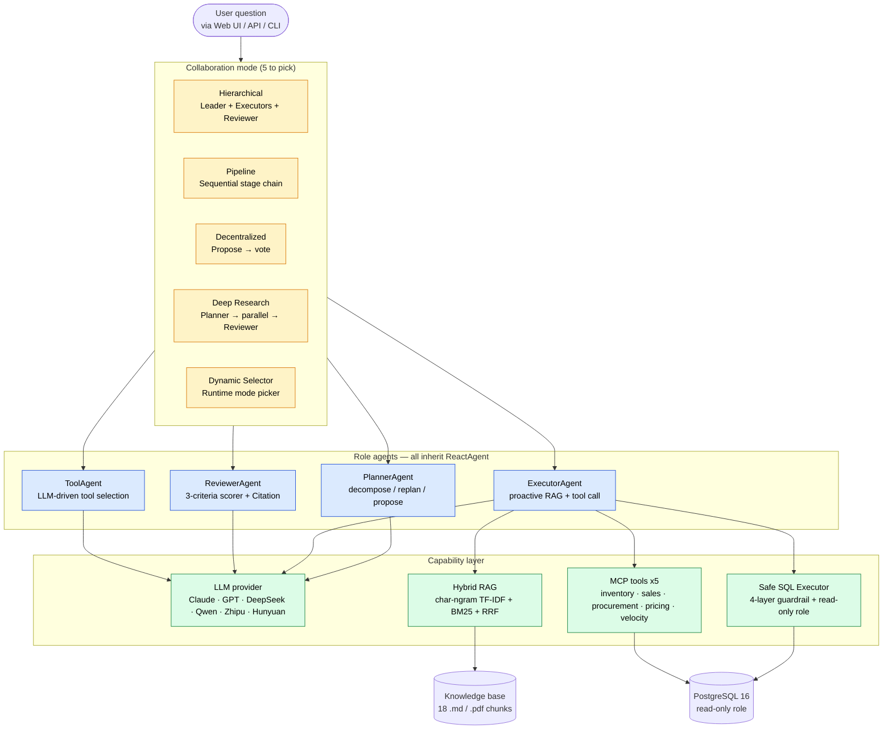
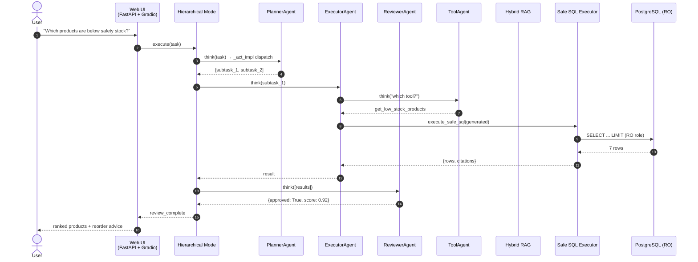
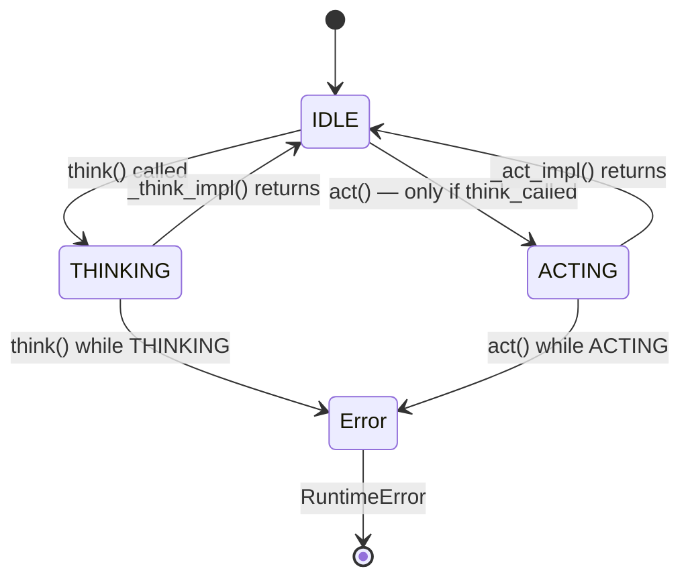
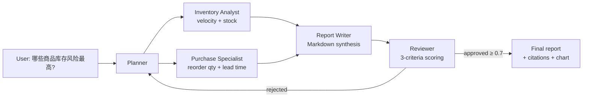
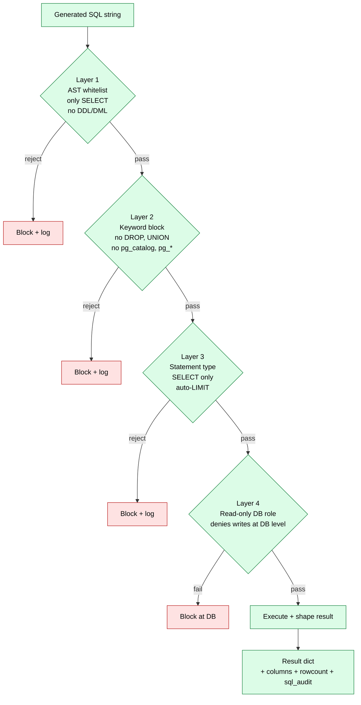
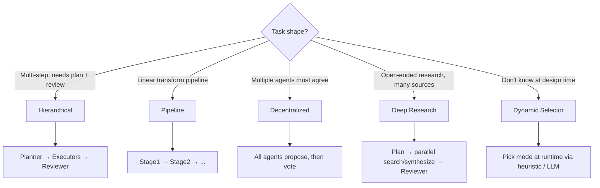

# MACS — System Architecture (Mermaid)

This document captures the full system architecture in Mermaid form so it
renders natively on GitHub, in Notion, and in any Markdown viewer that
supports the GFM spec.

## 1. Top-level: User → Mode → Agent → Capability

## 2. ERP AI Copilot request flow

## 3. ReactAgent strict think → act lifecycle

## 4. Multi-agent workflow: Inventory Risk Analysis

## 5. Safe SQL Executor — 4-layer guardrail

## 6. Collaboration mode selector

