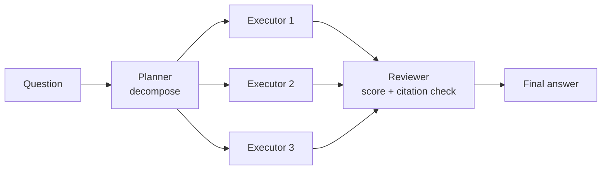
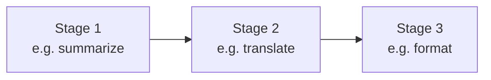
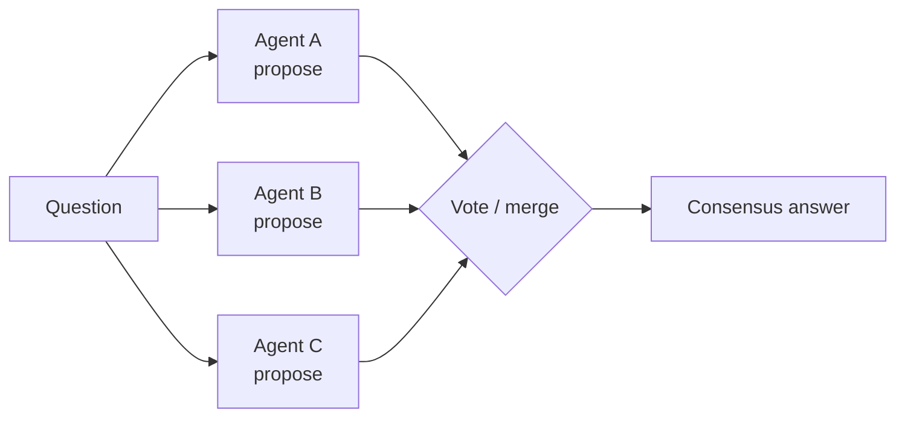
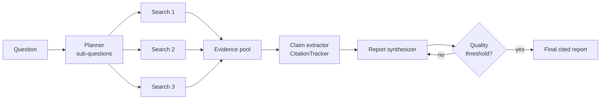
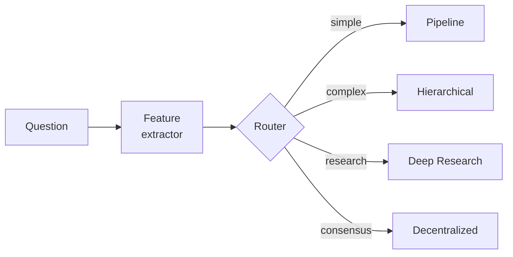

# Collaboration Modes — 5 patterns, 5 tradeoffs

> One question to ask before wiring agents: **how do they decide who does what?**
> MACS ships with five first-class modes. Pick by the answer.

```mermaid
flowchart LR
    Q{Task shape} --> M1[Hierarchical<br/>"decompose → execute → review"]
    Q --> M2[Pipeline<br/>"stage 1 → 2 → 3"]
    Q --> M3[Decentralized<br/>"propose → vote → merge"]
    Q --> M4[Deep Research<br/>"plan → parallel search → cite → critique"]
    Q --> M5[Dynamic Selector<br/>"let the router pick"]

    style M1 fill:#fef3c7
    style M2 fill:#dbeafe
    style M3 fill:#fce7f3
    style M4 fill:#dcfce7
    style M5 fill:#e0e7ff
```

## Quick selector

| If your task looks like… | Use | Class |
|---|---|---|
| "Break this into pieces, do them, then check the work." | **Hierarchical** | `HierarchicalMode` |
| "Run A, feed its output to B, then to C." | **Pipeline** | `PipelineMode` |
| "Three peers should each give a verdict, then we vote." | **Decentralized** | `DecentralizedMode` |
| "Need a cited, multi-source research report (5+ sources, self-critique loop)." | **Deep Research** | `DeepResearchMode` |
| "Don't know up front — pick the right mode per task." | **Dynamic** | `DynamicSelector` / `AdaptiveSelector` |

---

## 1. Hierarchical (Leader → Executors → Reviewer)

The workhorse mode. A planner agent decomposes the task, executor agents
work in parallel, and a reviewer agent validates the assembled answer.



- **Strengths**: Clear ownership, easy to debug, maps to org charts.
- **Weaknesses**: Single leader is a single point of failure for decomposition.
- **When to use**: Most multi-step business tasks (the ERP Copilot uses this for inventory risk).
- **Latency**: ~1× slowest subtask + 1 review.
- **Token cost**: 1 planner + N executors + 1 reviewer.
- **Entry point**: `from macs_pkg.collaboration import HierarchicalMode`

## 2. Pipeline (Sequential stages)

Each stage transforms the previous stage's output. No branching, no parallelism.



- **Strengths**: Predictable, cacheable, easy to test in isolation.
- **Weaknesses**: Bottlenecks at the slowest stage; no error recovery.
- **When to use**: Deterministic transforms (summarize → translate → format).
- **Latency**: sum of stage latencies.
- **Token cost**: sum of stage costs.
- **Variants**: `PipelineMode` (sequential) and `ParallelPipelineMode` (fan-out, then merge).
- **Entry point**: `from macs_pkg.collaboration import PipelineMode, ParallelPipelineMode`

## 3. Decentralized (Propose → Vote → Merge)

No leader. Each peer agent proposes an answer; the system merges via vote or aggregation.



- **Strengths**: Robust to single-agent hallucination; diversity improves coverage.
- **Weaknesses**: N× token cost; tie-breaking needs domain logic.
- **When to use**: High-stakes decisions where a single agent is risky (code review panels, fact-checking).
- **Latency**: max(proposer latencies) + vote merge.
- **Token cost**: N× agent + 1 merge.
- **Entry point**: `from macs_pkg.collaboration import DecentralizedMode`

## 4. Deep Research (Iterative cited-research loop)

Stanford-STORM-style. Plan → parallel search → evidence accumulation →
claim extraction → citation binding → synthesis → self-critique → revise.



- **Strengths**: Produces cited, auditable research reports. Self-critique catches hallucinations.
- **Weaknesses**: Slow (3-5× normal). Expensive (5+ LLM calls + searches).
- **When to use**: "Write me a competitive analysis of X with sources" / regulatory research.
- **Latency**: 10-60s typical.
- **Token cost**: 1 plan + N searches + extract + synthesize + critique loop.
- **Entry point**: `from macs_pkg.collaboration import DeepResearchMode`

## 5. Dynamic Selector (Meta-mode)

Wraps the other four. Inspects task features (`complexity`, `independence`,
`urgency`, `consensus_needed`, `requires_review`) and routes to the right
mode at runtime.



- **Strengths**: One entry point for many task shapes.
- **Weaknesses**: Routing is itself a learned/heuristic model — can be wrong.
- **Variants**: `DynamicSelector` (heuristic) and `AdaptiveSelector` (learns from past decisions).
- **Entry point**: `from macs_pkg.collaboration import DynamicSelector, AdaptiveSelector`

---

## Numbers in practice (ERP Copilot)

| Mode | Avg latency | Avg tokens | Used by |
|---|---|---|---|
| Hierarchical | ~3-8s | 1.2k | Inventory risk workflow |
| Pipeline | ~2-4s | 600 | Summarize-then-cite |
| Decentralized | ~5-10s | 2k | Code review (3 reviewers + vote) |
| Deep Research | ~15-40s | 4k+ | Competitive analysis reports |
| Dynamic | n/a | n/a | The Copilot's top-level dispatcher |

## How to swap modes in 3 lines

```python
# Today
from macs_pkg.collaboration import HierarchicalMode
mode = HierarchicalMode()

# Tomorrow — same `await mode.execute(question, agents=...)` API
from macs_pkg.collaboration import DeepResearchMode
mode = DeepResearchMode(max_rounds=3, quality_threshold=0.85)
```

All five implement the same `CollaborationMode` ABC — `execute(question, agents)`
returns a `WorkflowResult` dict with `success`, `elapsed_ms`, `final_report`,
and the raw `raw_history` of every agent's think→act.
