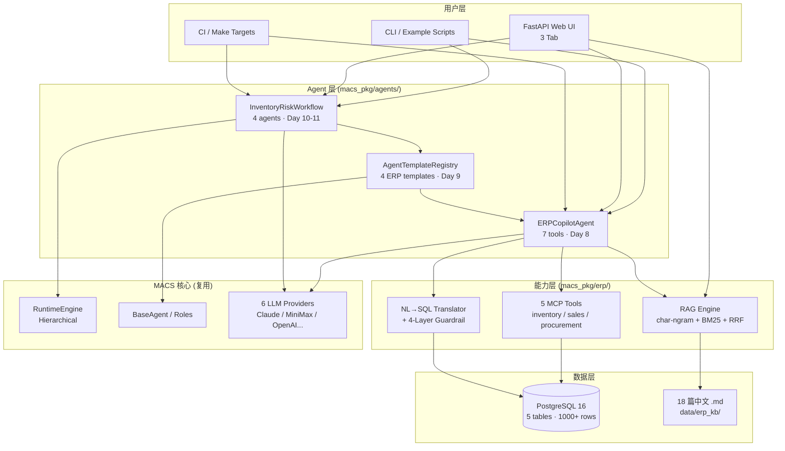
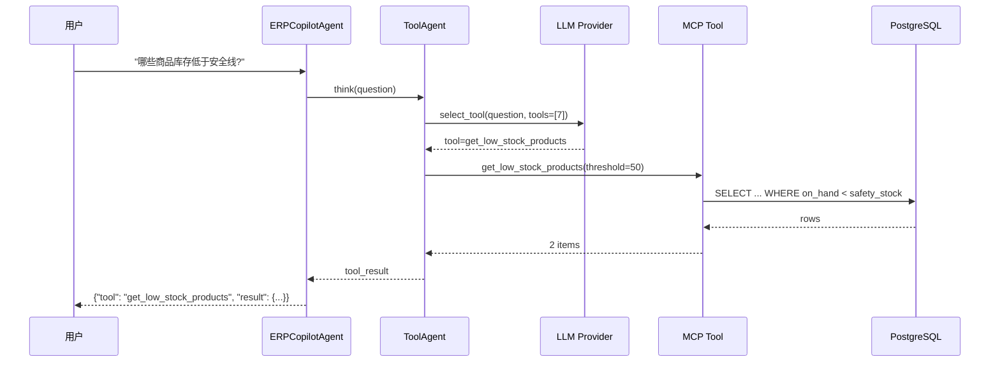
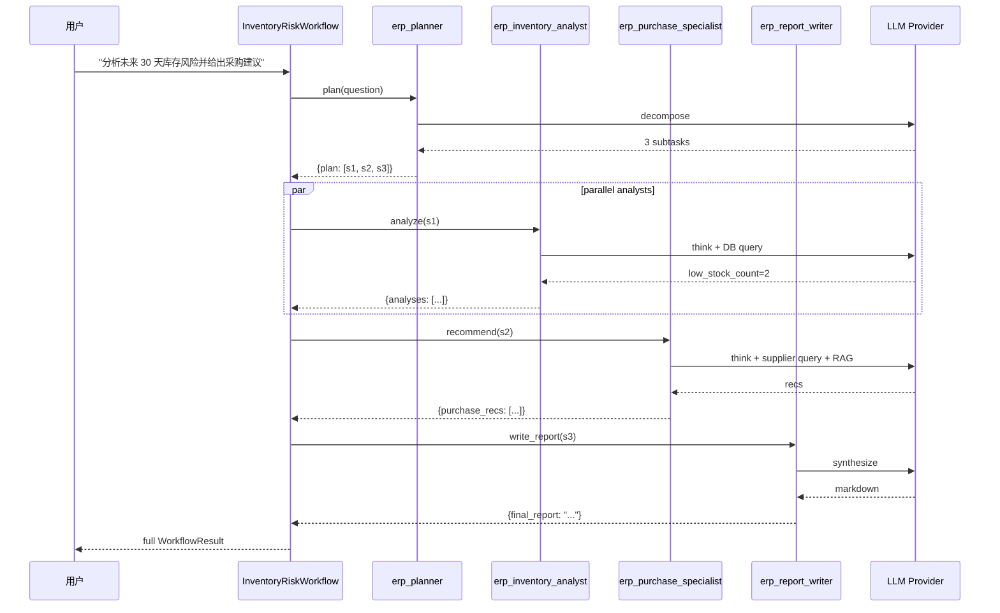
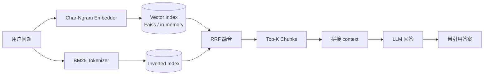
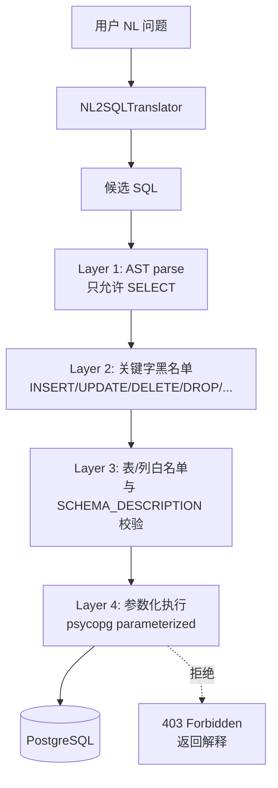
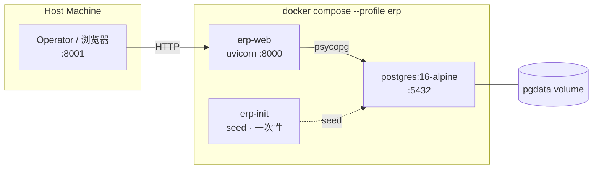

# ERP AI Copilot — 架构文档

> 描述 MACS → ERP AI Copilot 的模块切分、数据流、依赖关系。
> 配套 Mermaid 图可在 GitHub / VS Code Mermaid 扩展 / `make docs` 渲染。

## 顶层模块图

## 数据流: 单 Agent 查询

## 数据流: 多 Agent 工作流

## 数据流: RAG 知识库

## 依赖矩阵

| 模块 | 依赖 | 被谁依赖 |
|------|------|----------|
| `macs_pkg.erp.db` | `psycopg[binary,pool]` | tools, agents, web, health |
| `macs_pkg.erp.tools` | `db`, `mcp` | agents.copilot, examples |
| `macs_pkg.erp.nl2sql` | `db`, llm provider | agents.copilot, examples |
| `macs_pkg.erp.rag` | `rag.engine`, `data/erp_kb/` | agents.copilot, web, examples |
| `macs_pkg.erp.agents.copilot` | `db`, `tools`, `nl2sql`, `rag`, `core` | workflows, web, examples |
| `macs_pkg.erp.agents.templates` | `core.agent_template` | workflows |
| `macs_pkg.erp.workflows` | `agents.copilot`, `agents.templates`, `core.runtime` | examples, web |
| `macs_pkg.erp.web` | `agents.copilot`, `workflows`, `rag`, `health` | (部署) |
| `macs_pkg.erp.health` | `db`, llm provider, `rag` | web, CLI, k8s |

## 安全边界

## 部署拓扑 (docker-compose `--profile erp`)

## 关键设计决策

1. **PostgreSQL 而非 SQLite** — 支持并发写、JSONB、全文检索、materialized
   views. 与生产 ERP 系统同构.
2. **MCP 而非 Function Calling** — 工具层和 Agent 层解耦, 未来可以
   暴露给 IDE / 其他 agent 平台.
3. **Hybrid retrieval (embedding + BM25 + RRF)** — 单一方法在中文短查询
   表现不稳, RRF 融合两种信号.
4. **Hierarchical 而非 Flat** — Planner 先拆解, 4 个 executor 并行,
   Reviewer 收尾. 适合多步业务问题.
5. **Lazy resource** — DB / LLM / RAG 全部 lazy init, 单元测试 0
   外部依赖, 启动不需要任何 key.
6. **Health probe 单一源** — `macs_pkg.erp.health` 同时给 `/healthz`
   和 `make erp-check` 用.

## 文件清单 (按层)

### 数据层
- `macs_pkg/erp/db/connection.py` — `DatabaseConfig` / `DatabasePool`
- `macs_pkg/erp/db/schema.py` — 5 张表 DDL
- `macs_pkg/erp/db/seed.py` — Faker 1000+ 行
- `data/erp_kb/**/*.md` — 18 篇制度文档

### 工具层
- `macs_pkg/erp/tools/inventory_tools.py` — 5 个 async 函数
- `macs_pkg/erp/tools/server.py` — MCP server
- `macs_pkg/erp/nl2sql.py` — Translator + Validator + Executor
- `macs_pkg/erp/rag/indexer.py` + `query.py` — 索引 + 查询

### Agent 层
- `macs_pkg/erp/agents/copilot_agent.py` — 7 工具
- `macs_pkg/erp/agents/templates.py` — 4 模板

### 编排层
- `macs_pkg/erp/workflows/inventory_risk.py`

### 表现层
- `macs_pkg/erp/web/app.py` — FastAPI
- `macs_pkg/erp/web/static/index.html` — 3 Tab UI

### 横切
- `macs_pkg/erp/health.py` — 健康检查 (DB/LLM/RAG)
- `macs_pkg/erp/__init__.py` — 版本号

## 演化路径 (Day 15+ 之后)

| 阶段 | 增加 | 影响模块 |
|------|------|----------|
| 2 周 | 用户认证 + 多租户 | web, db |
| 4 周 | 真实 LLM 微调 (LoRA on ERP corpus) | rag, nl2sql |
| 8 周 | 切出 SaaS (Inventory Copilot, Procurement Copilot) | web, workflows |
| 12 周 | 真实 ERP 对接 (SAP / 用友 / 金蝶) | tools, db |
